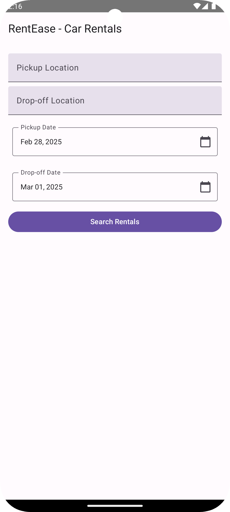

# RentEase

## Car Rental Search App

RentEase is a Car Rental Search application built using Jetpack Compose, Hilt for dependency
injection, and the Google Places API for location autocomplete. The app follows the MVVM
architecture and dynamically generates Kayak URLs for car rental searches.

---

## Features

- Search for car rentals using Google Places API.
- Dynamically generate Kayak search URLs.
- Modern UI with Jetpack Compose.
- Dependency injection using Hilt.

---

## Prerequisites

- **Android Studio** (Latest version recommended)
- **Minimum SDK:** 26
- **Target SDK:** 34
- **Google Places API Key**

---

## Setup Instructions

### 1. Clone the Repository

```sh
git clone <repository_url>
cd <project_directory>
```

### 2. Obtain a Google Places API Key

- Go to [Google Cloud Console](https://console.cloud.google.com/).
- Create a new project or select an existing one.
- Enable the **Places API**.
- Generate an API key and restrict it to Android apps (optional but recommended).

### 3. Add API Key to `local.properties`

Open `local.properties` and add the following:

```properties
PLACES_API_KEY=your_api_key_here
```

The key will be automatically injected into the project using Gradle.

### 4. Build and Run the Project

- Open the project in **Android Studio**.
- Sync Gradle by clicking **Sync Now**.
- Run the app on an emulator or a physical device.

---

## Screenshots


---

## Demo Video

Watch the demo:
[](Demo/demo.webm)

---

## Project Structure

```
/app
├── src/main/java/com/example/carrental
│   ├── di/         # Hilt Dependency Injection
│   ├── ui/         # Jetpack Compose UI Components
│   ├── viewmodel/  # ViewModels following MVVM architecture
│   ├── repository/ # Repository handling data operations
│   ├── model/      # Data models
│   ├── utils/      # Utility functions
│   └── MainActivity.kt  # Entry point of the application
```

---

## Dependencies

The project uses the following dependencies:

```gradle
implementation "androidx.compose.ui:ui:1.5.0"
implementation "androidx.hilt:hilt-navigation-compose:1.0.0"
implementation "com.google.dagger:hilt-android:2.44"
kapt "com.google.dagger:hilt-android-compiler:2.44"
implementation "com.google.android.libraries.places:places:3.2.0"
```

---

## Contributions

Feel free to contribute to this project by submitting issues and pull requests.

---

## License

This project is licensed under the **MIT License**.